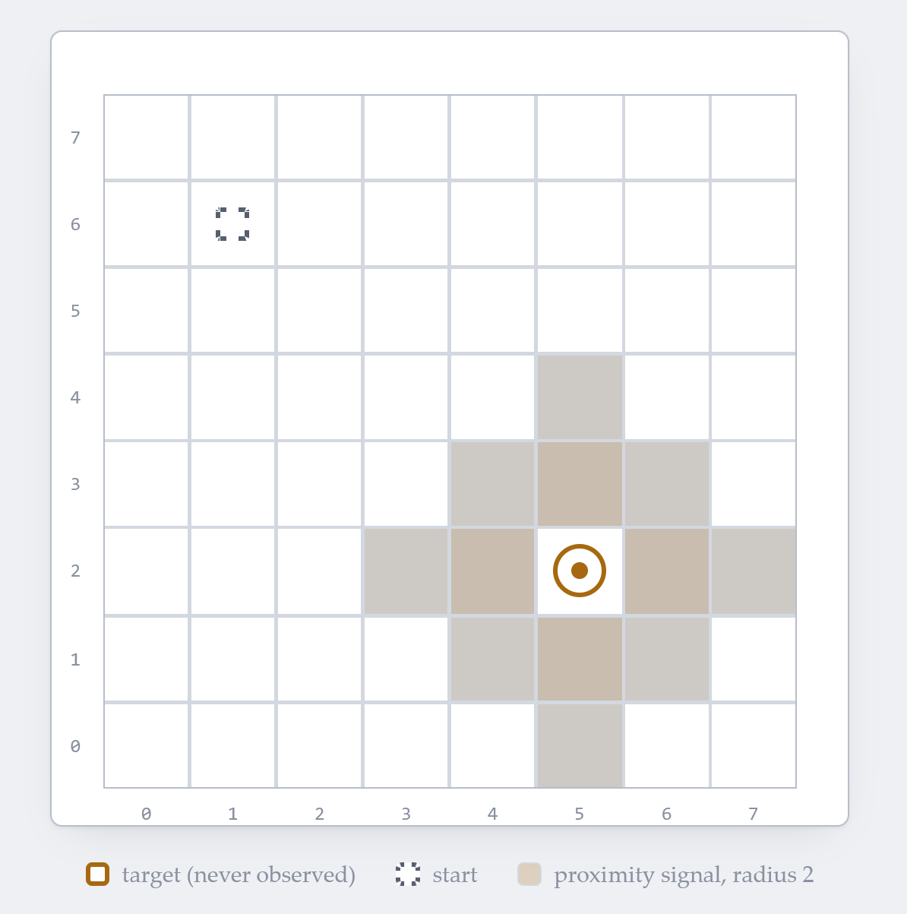
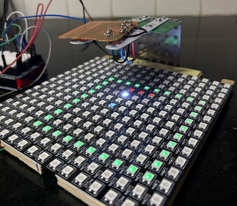
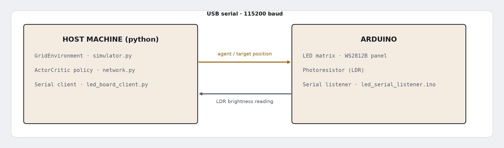
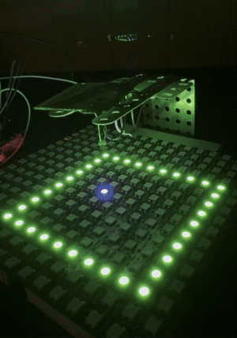
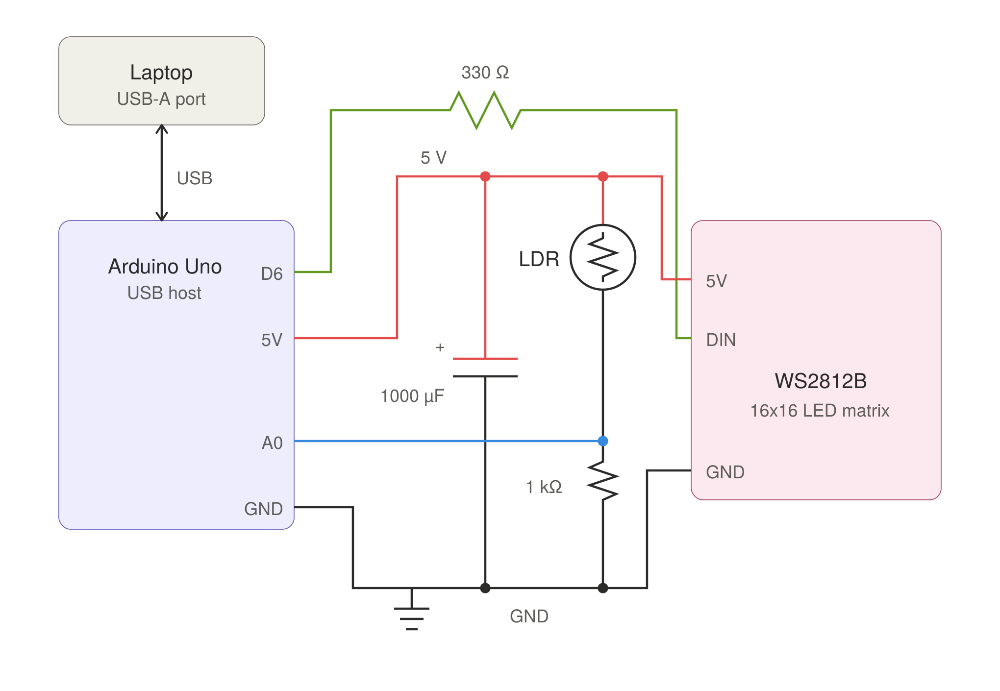
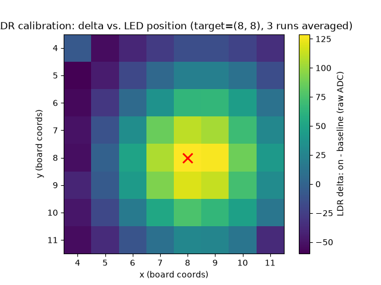

# Blind Target Search

*Learning to find a hidden target with reinforcement learning. Deploying the trained policy on an Arduino with LEDs and a light sensor.*

## The problem

A target sits at an unknown location within an 8×8 grid. Each episode, an agent starts at a random point in that grid and must reach the target using only movement and a coarse proximity signal received after every step: a "warmth" reading, strong near the target, fading to nothing a couple of cells out, and silent beyond that. The agent's observation never includes the target's location.

It's a blind search, like an ant following a faint scent trail to a sugar cube — no map, no coordinates, just a signal that gets stronger or weaker depending on which way it moves.

<p align="center"></p>

We implement this physically as a grid of LEDs, with a fixed photoresistor (LDR) reading brightness at the target's position. Since physically relocating the LDR every episode isn't practical, the target is instead fixed at the center of a larger 16×16 grid, and each episode uses a different random 8×8 subgrid (window) containing that center — which changes the target's position *relative to* the agent's local 8×8 view without ever moving the sensor. One LED lights up at a time to mark the agent's current position within that window; as it moves from cell to cell, the light reaching the fixed LDR changes with it — brighter the closer the active LED is to the target, dimmer farther away — and that brightness reading is the proximity signal the policy receives, standing in for the "warmth" described above.

<p align="center"></p>

We train a PPO policy to solve this purely in simulation, then evaluate the trained policy on this physical hardware.

<p align="center"></p>

The policy and the environment both live on a host machine in Python; the Arduino drives the LED display and reports the LDR reading.

<p align="center"></p>

## Docker Setup

Training and evaluation run inside a CUDA-enabled container so the environment (PyTorch, Hydra, accelerate, the Arduino CLI for firmware verification) is reproducible across machines.

**Key files:** [`docker/Dockerfile`](docker/Dockerfile), [`docker/build_docker.sh`](docker/build_docker.sh), [`docker/run_docker.sh`](docker/run_docker.sh), [`docker/docker_setup.md`](docker/docker_setup.md)

```
./docker/build_docker.sh   # build the image once
./docker/run_docker.sh     # start the container, mounting the repo at /workspace
```

[`test_docker_setup.py`](test_docker_setup.py) is a quick offline smoke test (no network, no downloads) that the image has CUDA/PyTorch working correctly. Run it inside the container:
```
pytest test_docker_setup.py -v
```

## Arduino Setup

One shared sketch drives whichever LED board is wired up; a compile-time flag picks the driver. Two boards are supported — a 16×16 WS2812B panel (default) and an 8×8 MAX7219 matrix — plus an LM358 photoresistor module for proximity feedback.

**Key files:** [`arduino/led_board_controller/firmware/led_serial_listener/`](arduino/led_board_controller/firmware/led_serial_listener/) (`led_serial_listener.ino`, `board_config.h`, `max7219_matrix_driver.cpp`, `ws2812b_matrix_driver.cpp`), [`arduino/led_board_controller/led_board_client.py`](arduino/led_board_controller/led_board_client.py), [`arduino/led_board_controller/power_model.py`](arduino/led_board_controller/power_model.py)

**Wiring:**
- WS2812B panel (default): data line → pin `6` (through a 330Ω series resistor), power from `5V`/`GND`
- MAX7219 matrix: `DIN → 12`, `CLK → 11`, `CS → 10`
- LM358 photoresistor module: `VCC → 5V`, `GND → GND`, `AO → A0`

**Power:** the panel runs directly off the Arduino's own `5V` pin — no external supply needed. Two things keep it within that limit: only a handful of LEDs are ever lit at once (the agent plus a few blinking boundary/target/trail pixels, never anywhere near all 256), and the firmware caps the global strip brightness at `kBrightness=40/255` (`ws2812b_matrix_driver.cpp`) as a safety margin on top of that. Together these keep draw to roughly 14mA average / 20mA peak across the whole panel (estimated per-frame by `power_model.py`) — well within what the Arduino's onboard regulator and USB supply. Lighting many more LEDs at once or raising the brightness cap changes this math fast: 256 LEDs at full brightness/white can draw on the order of 15A, far more than USB or the onboard regulator can provide — move to an external 5V supply first if you do either.

Set the active driver in `board_config.h`:
```c
#define ACTIVE_BOARD BOARD_WS2812B_MATRIX   // default; or BOARD_MAX7219_MATRIX
```
Then, in the Arduino IDE:
1. Open `led_serial_listener.ino` (the IDE loads `board_config.h` and the driver `.cpp` files alongside it automatically).
2. Under **Tools → Board**, select your board (Arduino Uno).
3. Under **Tools → Port**, select the port the board is connected to.
4. Click **Upload**.
5. If you open the Serial Monitor to watch the board directly, set its baud rate to `115200` to match the sketch.

**Connecting over WSL2/Docker:** if the board reaches the container through USB passthrough, one-time setup on the Windows host:
1. `winget install usbipd`.
2. `usbipd list` (admin PowerShell) to find the board's BUSID, then `usbipd bind --busid <busid>` once.
3. `usbipd attach --wsl --busid <busid>`.
4. Start the container with `./docker/run_docker.sh` — it detects `/dev/ttyUSB0`/`/dev/ttyACM0` and passes the device through.

After that, whenever the board drops (driver reinstall, unplug/replug), reattach it with [`docker/reconnect_usb.sh`](docker/reconnect_usb.sh) instead of recreating the container.

## Circuit Setup

<p align="center"></p>

## RL Framework

**Environment** — [`simulator.py`](simulator.py)'s `GridEnvironment`: places the subgrid/target/start, steps the agent (`left`/`right`/`up`/`down`), and reports back a `(x, y, score)` reading. `score` is a pure function of position — 1.0 at the target, decaying linearly to 0 at `score_radius` — so a short history of readings lets the agent tell whether its last move helped. Defaults: `grid_size=16`, `subgrid_size=8`, `score_radius=2`, `max_steps=100`, `history_length=4`.

Reward per step:

| Condition | Reward |
|---|---|
| Reached the target | `success_bonus` (default `1.0`) |
| Otherwise | `score(new) − score(old)` (positive for closing in, negative for backing off) |
| ...and the new cell is blank (outside `score_radius`, `score == 0`) | additionally `− step_penalty` (default `0.01`) |
| ...and the move was illegal (hit the subgrid boundary, a no-op) | additionally `− wall_penalty` (default `0.05`) |

**Network** — [`network.py`](network.py)'s `ActorCritic`, a shared-trunk MLP:
```
input:  (x, y, score) × window_length
   ↓
Linear(window_length×3 → hidden_dim)
   ↓ ReLU
Linear(hidden_dim → hidden_dim)            repeated, num_layers hidden blocks total
   ↓ ReLU
   ├─ policy head → Linear(hidden_dim → 4)   action logits
   └─ value head  → Linear(hidden_dim → 1)   scalar value
```
Defaults: `window_length=4` (how many of the environment's `history_length` readings the network sees), `hidden_dim=64`, `num_layers=3`.

**Training signal** — [`ppo.py`](ppo.py) implements clipped-surrogate PPO with GAE advantages (computed per episode in [`rollout.py`](rollout.py)):

```
δ_t = r_t + γ·V(s_t+1) − V(s_t)                A_t = δ_t + (γλ)·δ_t+1 + (γλ)²·δ_t+2 + ...

r_t(θ) = π_θ(a_t|s_t) / π_θold(a_t|s_t)        L_CLIP(θ) = E_t[ min(r_t·A_t, clip(r_t, 1−ε, 1+ε)·A_t) ]

L(θ) = −L_CLIP(θ) + c1·(V(s_t) − R_t)² − c2·entropy(π_θ)
```

## Tests

**Key files:** [`test_simulator.py`](test_simulator.py), [`test_network.py`](test_network.py), [`test_eval_lib.py`](test_eval_lib.py)

```
pytest test_simulator.py test_network.py test_eval_lib.py -v
```
Covers the environment (subgrid/target placement, movement clamping, termination, observation history), the network (initialization, the init-seed isolation used for multi-seed comparisons), and the deterministic eval policy. `test_docker_setup.py` is separate — see [Docker Setup](#docker-setup).

## Training

**Key files:** [`train.py`](train.py), [`conf/config.yaml`](conf/config.yaml) (fast smoke test), [`conf/config_train.yaml`](conf/config_train.yaml) (full 150-epoch run), [`run_ablation.py`](run_ablation.py)

One epoch = collect `episodes_per_epoch` episodes → GAE → a few epochs of minibatch PPO updates → a deterministic eval pass → checkpoint. Everything is a [Hydra](https://hydra.cc) config field, overridable on the command line.

Logging goes to [Weights & Biases](https://wandb.ai) — run `wandb login` once, then:
```
python3 train.py                                    # fast smoke test (1 epoch)
python3 train.py --config-name config_train         # full run, 3 seeds by default (cfg.seeds)
python3 train.py training.num_epochs=5 ppo.learning_rate=1e-4   # override any field
accelerate launch --config_file conf/accelerate.yaml train.py --config-name config_train
```
Set `conf/wandb_workspace_url.txt` to your own saved multi-run workspace view to have `train.py` print a link to it alongside each run's URL.

Checkpoints land in `trained_models/<run_name>_seed<seed>/epoch_N/`, one directory per seed, each with its own resolved `config.yaml` so an eval script can reconstruct the exact architecture later.

[`run_ablation.py`](run_ablation.py) sweeps a set of architecture configs (named in its `CONFIGS` list, e.g. `config_train_h64_l3_hist4`) across `cfg.seeds`, skipping any checkpoint that already exists. Only the baseline `conf/config_train.yaml` ships in this repo, so before running an ablation, create one `conf/<name>.yaml` per architecture point by copying it and overriding `network.hidden_dim`, `network.num_layers`, `env.history_length`, and `output.run_name` — then either name them to match `CONFIGS` or pass `--configs <name> ...` explicitly:
```
python3 run_ablation.py --parallel 4
```

## Evaluation

**Key files:** [`eval_random.py`](eval_random.py), [`build_eval_fixed_dataset.py`](build_eval_fixed_dataset.py), [`eval_fixed_dataset.py`](eval_fixed_dataset.py)

A trained checkpoint is included at `trained_models/h64_l3_hist4_ep150_seed43/epoch_150` (`hidden_dim=64`, `num_layers=3`, 150 epochs) so evaluation can be run immediately, without training first:
```
python3 eval_random.py checkpoint_dir=trained_models/h64_l3_hist4_ep150_seed43/epoch_150 episodes=200 seed=7
python3 eval_fixed_dataset.py checkpoint_dir=trained_models/h64_l3_hist4_ep150_seed43/epoch_150
```
`eval_random.py` draws fresh random episodes each run. `eval_fixed_dataset.py` instead replays the same 100 committed problem instances every time (`eval_fixed_dataset.json`, stratified by distance and by whether the target sits near the subgrid's edge), so two checkpoints can be compared on identical problems and broken down by category rather than just an aggregate success rate.

## Evaluation with Arduino

**Key files:** [`eval_ldr_sweep.py`](eval_ldr_sweep.py), [`eval_demo_16-16-ldr-feedback.py`](eval_demo_16-16-ldr-feedback.py), [`arduino/led_board_controller/led_board_client.py`](arduino/led_board_controller/led_board_client.py)

This is the closed-loop version of evaluation: the policy's proximity reading comes from a real LDR pointed at the target position instead of the simulator's distance formula. Two steps:

**1. Calibrate once, offline.** A probe LED sweeps the 8×8 window around the target; the LDR's brightness delta from a single ambient baseline is recorded at every cell and pooled by Manhattan distance into the same four levels the trained policy expects.
```
python3 eval_ldr_sweep.py --calibrate
```
<p align="center"></p>

**2. Run the live episode.** Two passes with the same seed: a noiseless "perfect world" reference pass (target visibly lit), then the real LDR-driven pass (target deliberately unlit, so the board never gives away what the sensor has to find on its own).
```
python3 eval_demo_16-16-ldr-feedback.py checkpoint_dir=trained_models/h64_l3_hist4_ep150_seed43/epoch_150 seed=7
```
Reports steps/return/success for both passes plus the step-count gap between them.